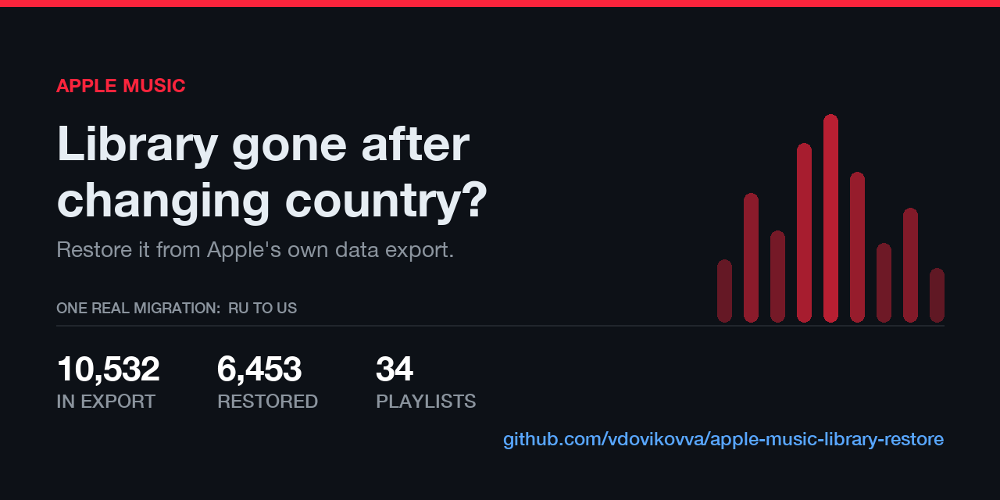

# Восстановление медиатеки Apple Music после смены страны аккаунта



**English version: [README.md](README.md)**

Вы сменили страну Apple ID — или перешли на новый аккаунт — и медиатека Apple
Music оказалась пустой. Плейлисты исчезли, альбомы исчезли, тысячи треков
исчезли. Apple не переносит медиатеку между витринами, и поддержка её не
вернёт.

Этот инструмент восстанавливает её из выгрузки данных, которую Apple выдаёт
бесплатно.

> Проверено 6 августа 2026 на Apple Music API v1: медиатека из 10 532 треков
> перенесена с витрины `RU` на `US`. Восстановлено **83,6%** треков, у которых
> был каталожный ID, и все плейлисты, состав которых сохранился в выгрузке.

---

## Почему очевидные способы не работают

**«Импортировать JSON в приложение Музыка».** Команда `add` в Музыке
принимает файлы с диска. Искать треки в стриминге по названию она не умеет.
В AppleScript вообще нет команды, добавляющей каталожный трек в медиатеку.

**«Воспользоваться сервисом переноса плейлистов».** Такие сервисы сопоставляют
треки по тексту «артист — название». Для плейлистов сойдёт, но на ремиксах,
концертных записях, радиоверсиях и кириллице они ошибаются. И они переносят
плейлисты, а не медиатеку.

**«В выгрузке же есть ID, просто добавьте их».** Есть — и в этом главная
ловушка: **каталожные ID Apple Music привязаны к витрине.** У одного и того же
трека в каждой стране свой числовой идентификатор. Примерно треть ID из вашей
выгрузки в другой витрине не значит ничего.

## Что делает этот инструмент

В выгрузке лежат настоящие каталожные ID, а не только текст. Это позволяет
сопоставлять точно — принципиально надёжнее любого текстового поиска.
Остаётся перевести ID между витринами, и делается это каскадом из трёх
методов, от самого надёжного к самому широкому:

| Шаг | Как работает | Покрытие | Точность |
|---|---|---:|---:|
| **1. ISRC** | каталог-источник → ISRC → `filter[isrc]` в целевом | 24% | **100%** |
| **2. Прямой ID** | часть ID совпадает между витринами | 63–66% | 96% |
| **3. Конвертер** | `filter[equivalents]`, штатный конвертер Apple | 76% | 87% |

Каждое совпадение затем сверяется с исходной длительностью трека. Это важнее,
чем кажется: конвертер спокойно возвращает семиминутный extended mix там, где
запрашивали трёхминутный radio edit. Ловится это только по длительности.

Всё, что проверку не прошло, отправляется в `manual_review.csv` — решать вам,
а не эвристике.

Полные измерения и подводные камни — в [docs/FINDINGS.md](docs/FINDINGS.md).

## Что возвращается

- **Треки** — всё, что есть в каталоге новой страны
- **Плейлисты** — с сохранением исходного порядка треков
- **Альбомы и артисты** — собираются сами из добавленных треков
- **Кураторские плейлисты Apple**, на которые вы были подписаны

## Что потеряно навсегда

Стоит понимать заранее:

- **Личные загрузки (iTunes Match).** После окончания подписки Apple удаляет
  облачные копии. В медиатеке остаются только названия — серые записи, которые
  не играют. Вернуть их можно лишь из локальной резервной копии.
- **Покупки** остаются привязаны к старому Apple ID. Их можно перекачать там,
  но перенести на новый аккаунт нельзя.
- **Счётчики прослушиваний, даты добавления, история оценок.** API не
  позволяет их записать.
- **Треки, выпавшие из каталога целевой страны.**
- **Смарт-плейлисты и Genius-миксы.** Их правила в выгрузку не попадают.

---

## Связь

Вопросы, баг-репорты или замеры с вашей библиотеки — открывайте issue или
пишите на **vdovikov@me.com**.

## Требования

- Python 3.9+ (сторонних пакетов не нужно, только стандартная библиотека)
- **Активная подписка Apple Music на новом аккаунте.** Без неё добавлять
  каталожные треки нельзя в принципе.
- Выгрузка ваших данных Apple

## Получить выгрузку

1. Зайдите на [privacy.apple.com](https://privacy.apple.com) → *Запросить копию данных*
2. Выберите **Сведения о мультимедийных сервисах Apple**
3. Ждите — Apple готовит до 7 дней
4. Распакуйте и найдите папку `Apple_Media_Services/Apple Music Activity`

## Получить токены

Нужны два токена. Откройте [music.apple.com](https://music.apple.com) в Chrome
или Safari под **новым** аккаунтом.

**Вариант А — официальный (Apple Developer Program, 99 $/год).** Сгенерируйте
developer token по [документации Apple](https://developer.apple.com/documentation/applemusicapi/generating-developer-tokens),
затем получите Music User Token через MusicKit JS. Этот путь предусмотрен Apple.

**Вариант Б — токен веб-плеера.** Откройте консоль браузера и выполните:

```js
copy(JSON.stringify({
  developer_token: MusicKit.getInstance().developerToken,
  music_user_token: document.cookie.match(/media-user-token=([^;]+)/)[1]
}, null, 2))
```

Готовый JSON окажется в буфере обмена. Если консоль пишет, что `MusicKit` не
определён, включите любой трек на секунду и повторите.

> **О варианте Б.** Он использует тот же токен, на котором работает веб-плеер
> Apple. Вы обращаетесь к собственной медиатеке собственным ключом, ничего не
> обходя и не затрагивая чужие данные, — но условиями Apple такое применение
> не предусмотрено. Решение за вами. Токены живут месяцами; никогда не
> публикуйте `tokens.json` — он даёт полный доступ к вашей медиатеке.

Сохраните результат:

```bash
cp tokens.example.json tokens.json
# вставьте два значения в tokens.json
```

---

## Использование

Шаги выполняются по порядку. Всё до третьего шага — только чтение.

```bash
EXPORT="/путь/к/Apple_Media_Services/Apple Music Activity"

# 1. Проверка токенов и оценка восстановимого (~2 мин, только чтение)
python3 01_check.py --export "$EXPORT" --from ru --to us

# 2. Резолв всей медиатеки, отчёты в CSV (~30-60 мин, только чтение)
python3 02_resolve.py --export "$EXPORT" --from ru --to us

# --- откройте work/manual_review.csv и просмотрите спорные совпадения ---

# 3. Добавление треков — сначала превью, затем запись
python3 03_add_tracks.py --export "$EXPORT"
python3 03_add_tracks.py --export "$EXPORT" --apply

# 4. Плейлисты — так же
python3 04_add_playlists.py --export "$EXPORT"
python3 04_add_playlists.py --export "$EXPORT" --apply
```

Оба пишущих шага по умолчанию показывают превью и ничего не делают, пока не
передан `--apply`.

В `--from` укажите страну, из которой переезжаете, в `--to` — новую.

### Если что-то пошло не так

```bash
python3 03_add_tracks.py --undo
```

Каждый добавленный трек записан в журнал, поэтому откат удалит ровно то, что
добавил инструмент, и ничего больше. Прерванный запуск продолжается с места
остановки — просто запустите ту же команду снова.

### Добавить одобренные вручную

Отредактируйте `work/manual_review.csv`, удалите ненужные строки, затем:

```bash
python3 03_add_tracks.py --include-manual work/manual_review.csv --apply
```

### Если старого Apple ID больше нет

Заблокирован, удалён или просто уже не ваш — тогда нет ни токена от него, ни
выгрузки. Остаётся приложение «Музыка» на Маке, где этот аккаунт был: в нём
ещё лежат метаданные медиатеки, и AppleScript их читает.

В таком снимке **нет каталожных ID** — «Музыка» их не отдаёт, — так что
каскад по ID выше не работает. Треки сопоставляются по тексту и длительности:
это менее точно и сильно медленнее, потому что `/search` у Apple сдыхает
после нескольких сотен запросов и потом долго отвечает 429. Шаг 2 ниже сам
сбавляет темп и продолжает с контрольной точки.

Снимок надо снять **до** того, как «Музыка» выйдет из старого аккаунта, пока
медиатека ещё на месте.

```bash
# 0. Снимок медиатеки «Музыки» с Мака в формате выгрузки (только чтение)
python3 00_dump_local.py --out work/local-export

# 1. Сверка с медиатекой нового аккаунта -> work/delta.json (только чтение)
python3 01_diff_ru.py --snapshot work/local-export

# 2. Поиск недостающего в целевом каталоге -> work/tracks.csv
#    (только чтение, может идти часами; та же команда продолжает с места)
python3 02_find_ru.py --delta work/delta.json --store ru

# 3. Добавление найденного — сначала превью, затем запись
python3 03_add_tracks.py --export work/local-export
python3 03_add_tracks.py --export work/local-export --apply

# 4. Плейлисты — так же; --only восстанавливает один конкретный
python3 04_add_playlists.py --export work/local-export
python3 04_add_playlists.py --export work/local-export --apply
```

`--store` на втором шаге — страна нового аккаунта. По умолчанию сопоставление
строгое (название ≥ 0,90, артист ≥ 0,80, длительность в пределах 5 с);
`--loose` принимает по одной длительности, и такой результат стоит просмотреть
руками перед третьим шагом.

**Плейлист есть на Маке, но не доходит до телефона?** Поищите в нём треки
типа «Поток интернет-аудио» без адреса. Это остатки треков, которые лежали в
плейлисте, но не в медиатеке, и, судя по всему, из-за них весь плейлист не
уходит в облако. Копию на Маке не чините: пересоздайте плейлист четвёртым
шагом (`--only "Название"`), дождитесь, пока он приедет на Мак вторым
плейлистом, и удалите старый. Подробности — в
[FINDINGS](docs/FINDINGS.ru.md#плейлисты-которые-остаются-на-маке-и-не-доходят-до-телефона).

---

## Подводные камни

- **Запись в медиатеку работает только на `amp-api.music.apple.com`.** На
  `api.music.apple.com` метод `DELETE` возвращает 401, притом что `GET` и
  `POST` проходят. На это ушло несколько часов.
- **HTTP 202 не означает успех.** Apple принимает запрос и может молча не
  добавить трек: лицензия релиза запрещает добавление в медиатеку, хотя
  слушать его можно. В тестах так себя вели 3,5% треков. Обойти нельзя.
- **`filter[equivalents]` принимает один ID за запрос.** ISRC-путь батчится по
  100 — поэтому в каскаде он идёт первым.
- **Серые треки без `playParams`** — это мёртвые записи, а не восстановленная
  музыка. При дедупликации их нельзя считать за «уже есть».
- Лимит Apple — около 20 запросов в секунду, инструмент держит около 3.

## Тесты

```bash
python3 test_logic.py
```

Покрывают логику принятия решений — ту, что при ошибке тихо портит перенос:
проверку длительности, порядок треков в плейлистах, одноимённые плейлисты.
Ни сети, ни токенов, ни аккаунта не требуется.

## Планы

Пока не реализовано, помощь приветствуется:

- Восстановление лайков (`PUT /v1/me/ratings/songs/{id}`)
- Перекачивание покупок со старого Apple ID

## Отказ от ответственности

Проект не связан с Apple и не одобрен ею. Распространяется как есть по
лицензии MIT. Инструмент работает только с вашей собственной медиатекой, и
третий шаг — первый, который вообще что-то записывает. Перед запуском на
дорогой вам медиатеке прочитайте [docs/FINDINGS.md](docs/FINDINGS.md).
